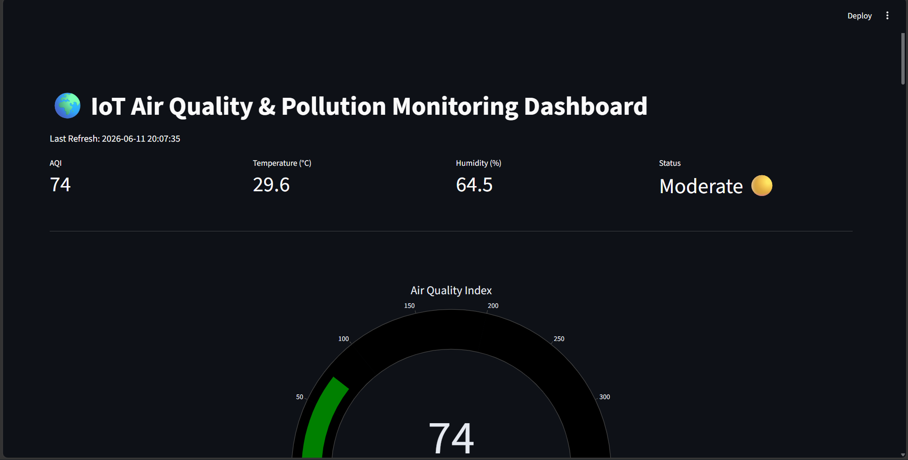
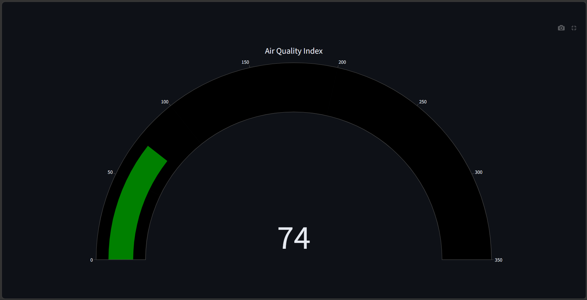
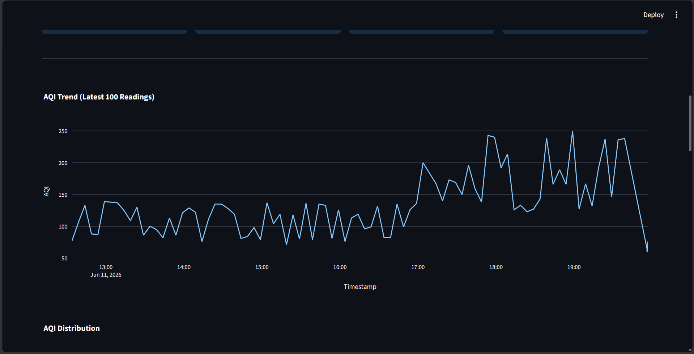
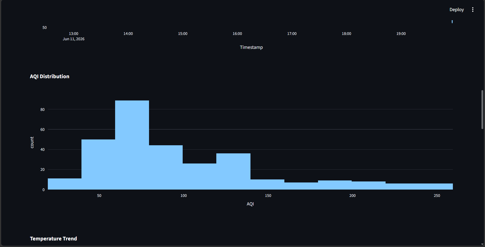
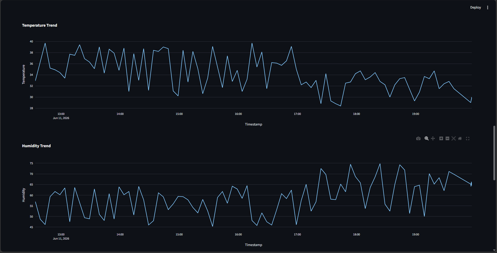
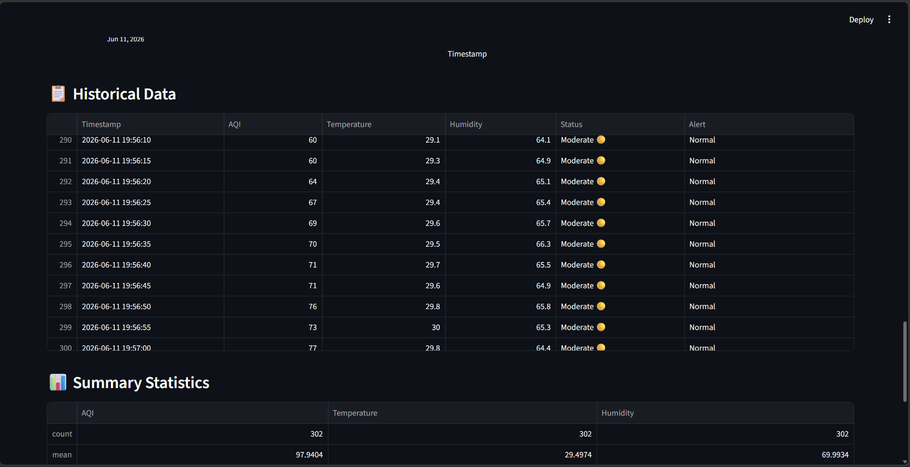
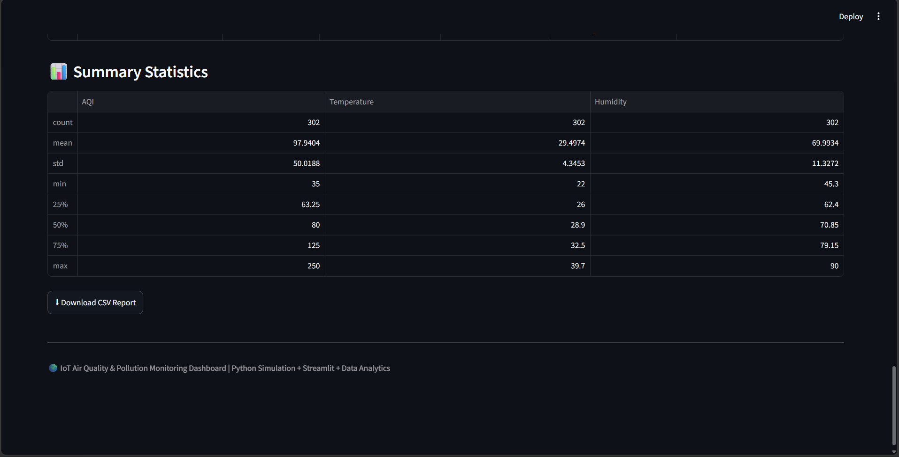
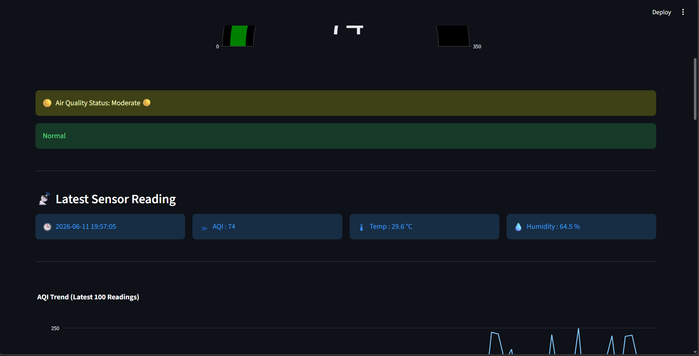
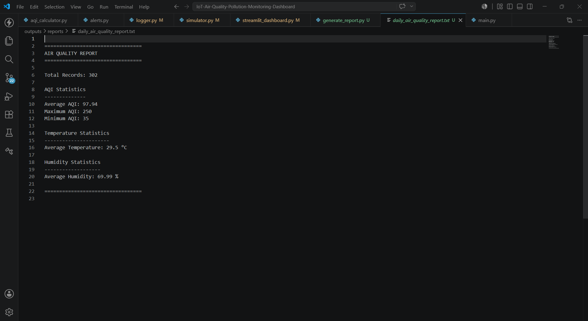
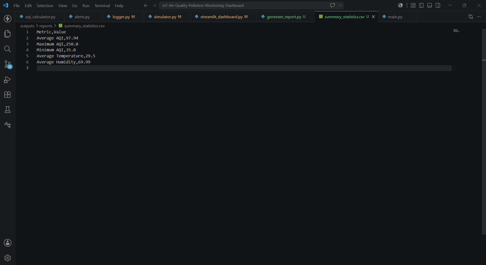

# 🌍 IoT-Based Air Quality & Pollution Monitoring Dashboard

A real-time IoT-inspired environmental monitoring system designed to track and analyze air quality conditions using live sensor simulation, data analytics, automated reporting, and an interactive Streamlit dashboard.

## 🚀 Live Demo

🔗 Live Application: https://iot-based-air-quality-pollution-monitoring-dashboard-fshxjjh7c.streamlit.app/

---

## 📖 Project Overview

Air pollution is one of the major environmental challenges affecting public health and urban sustainability. This project simulates an IoT-based Air Quality Monitoring System capable of collecting environmental parameters, analyzing pollution levels, generating alerts, and visualizing trends through an interactive dashboard.

The system continuously monitors:

* 🌫 Air Quality Index (AQI)
* 🌡 Temperature
* 💧 Humidity
* 🚨 Pollution Alerts
* 📊 Historical Trends
* 📝 Automated Reports

The dashboard refreshes automatically, providing a near real-time monitoring experience similar to industrial IoT solutions.

---

## ✨ Features

### 📡 Real-Time Environmental Monitoring

* Live AQI monitoring
* Temperature tracking
* Humidity tracking
* Continuous sensor simulation

### 📊 Interactive Analytics Dashboard

* AQI Trend Analysis
* Temperature Trend Visualization
* Humidity Trend Visualization
* AQI Distribution Analysis
* Historical Data Monitoring

### 🚨 Intelligent Alert System

* Good Air Quality Detection
* Moderate Pollution Alerts
* Poor Air Quality Warnings
* Hazardous Condition Notifications

### 📋 Automated Reporting

* Daily Air Quality Report Generation
* Summary Statistics Report
* CSV Export Functionality
* Downloadable Data Reports

### 🔄 Live Dashboard Updates

* Automatic Refresh Every 5 Seconds
* Continuous Data Logging
* Real-Time Monitoring Experience

---

## 🛠️ Technology Stack

### Frontend

* Streamlit

### Backend

* Python

### Data Processing

* Pandas
* NumPy

### Visualization

* Plotly

### Reporting

* CSV
* TXT Reports

### Simulation

* Python-Based Sensor Simulator

---

## 📂 Project Structure

```text
IoT-Air-Quality-Pollution-Monitoring-Dashboard
│
├── arduino_code/
├── circuit_diagram/
├── dashboard/
│   └── streamlit_dashboard.py
│
├── python_simulation/
│   ├── simulator.py
│   ├── logger.py
│   ├── alerts.py
│   └── aqi_calculator.py
│
├── data/
│   └── air_quality_logs.csv
│
├── outputs/
│   ├── charts/
│   ├── reports/
│   └── screenshots/
│
├── reports/
│   └── generate_report.py
│
├── docs/
├── images/
│
├── main.py
├── requirements.txt
└── README.md
```

---

## 📸 Project Screenshots

### Dashboard Home



### AQI Gauge



### AQI Trend Chart



### AQI Distribution



### Temperature & Humidity Trend



### Historical Data



### Summary Statistics



### Live Sensor Monitoring



### Daily Report



### Summary CSV Report



---

## 📈 Generated Outputs

### Charts

* AQI Trend Chart
* AQI Distribution Chart
* AQI Gauge Chart
* Temperature Trend Chart
* Humidity Trend Chart

### Reports

* Daily Air Quality Report
* Summary Statistics CSV

### Screenshots

* Dashboard Views
* Analytics Outputs
* Monitoring Screens

---

## ⚙️ Installation

### Clone Repository

```bash
git clone https://github.com/YOUR_USERNAME/IoT-Air-Quality-Pollution-Monitoring-Dashboard.git
```

### Navigate to Project

```bash
cd IoT-Air-Quality-Pollution-Monitoring-Dashboard
```

### Create Virtual Environment

```bash
python -m venv venv
```

### Activate Environment

```bash
venv\Scripts\activate
```

### Install Dependencies

```bash
pip install -r requirements.txt
```

---

## ▶️ Run Application

### Generate Sensor Data

```bash
python python_simulation/simulator.py
```

### Generate Reports

```bash
python reports/generate_report.py
```

### Launch Dashboard

```bash
streamlit run main.py
```

---

## 📊 Sample Outputs

* Real-Time AQI Monitoring
* Automated Environmental Reports
* Trend Analysis Dashboard
* Air Quality Classification
* Historical Data Analytics

---

## 🎯 Future Enhancements

* ESP32 Integration
* MQTT Communication
* Node-RED Dashboard
* ThingSpeak Cloud Integration
* Email Alerts
* SMS Notifications
* Mobile Monitoring App
* Predictive Air Quality Analytics

---

## 👩‍💻 Author

**Vaishnava Devi**

---

## 📜 License

This project is licensed under the MIT License.
